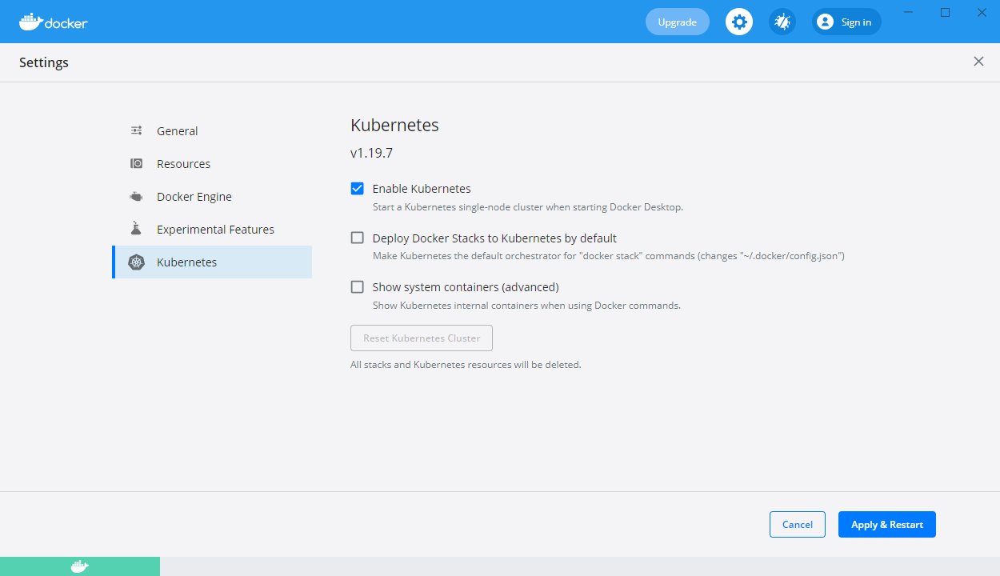
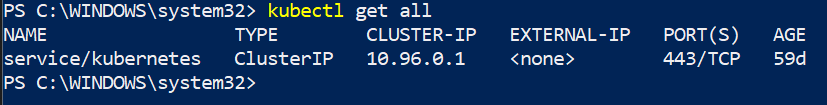

# Índice

 - [Requisitos](#requisitos)
 - [Índice de ejemplos](#índice-de-ejemplos)
 - [Preguntas de autoevaluación](#preguntas-de-autoevaluación)

# Requisitos

 - Conocimientos de Docker.
 - Docker Desktop instalado.
 - kubectl ( https://kubernetes.io/docs/tasks/tools/install-kubectl-windows/ 
 - Powershell.
 - Una vez instalado Docker y kubectl iniciar Docker y habilitar la opción "Kubernetes"



una vez que inició abrir una ventana de Powershell y ejecutar "kubectl get all" y deberían ver algo similiar a esto:



# Índice de ejemplos

- [General](#general)
- [Pods](k8s.pods.md)
- [Deployments](k8s.deployments.md)
- [Service](k8s.services.md)
- [Storage](k8s.storage.md)
- [ConfigMaps](k8s.configmaps.md)
- [Secrets](k8s.secrets.md)

# General
Consultar configuración de Kubectl
``` powershell
kubectl config view
```

Consultar todos los objetos

``` powershell 
kubectl get all
```

``` powershell 
kubectl get all -o wide
```

``` powershell 
kubectl get pods
```

[Pods](k8s.pods.md)

# Preguntas de autoevaluación (V/F)

 - Un Pod es equivalente a un container de Docker
 - Un Pod solo puede contener un container
 - Es posible crear Pods mediante comandos, sin YAML
 - Un ConfigMap puede montarse como un volumen
 - El emptyDir no es visible fuera del Pod
 - Con un NodePort se puede acceder a los servicios desde fuera de cluster
 - Es posible escalar horizontalmente un deployment mediante un comando
 - Es posible crear un Pod sin deployment
 - Es posible escalar un Pod sin deployment
 - Es necesario declarar un volument dentro del deploymente antes de poder montarlo a un Pod
 - Con un HostPath me aseguro de que la información vivirá por siempre
 - Un PersistentVolumeClaim es una indirección a un PersistenVolume
 - Con el comando **exec** podemos ejecutar comandos sobre los containers
 - El LoadBalancer ignora las **labels** de los objetos, los relaciona por la IP
 - Por defecto un Pod no es accesible desde otro Pod
 - Un ConfigMap se puede utilizar para configurar environment variables en un container
 - Existe la opción de cargar solamente un valor de un ConfigMap en un environment variable
 - Si editamos un secret el cambio se refleja en los volúmenes que lo utilizan
 - Si editamos un secret el cambio no se refleja en los environment variables

